# Auto Email Responder - System Flow Documentation

This document outlines the complete system flow for the Auto Email Responder application, showing what happens in the background for each API endpoint and the sequence of function calls.

## System Architecture Overview

The Auto Email Responder consists of four main services:
- **Gmail Service**: Gmail API integration
- **Policy Service**: Company policy management with vector search
- **Response Generator**: AI-powered response generation
- **Cache Service**: Redis-based caching

---

## 1. Send Single Email (`POST /emails/send`)

### Background Process Flow

**Client Request** → **FastAPI Router** → **Response Generator** → **Policy Service** → **Cache Service** → **Gmail Service** → **Response**

### Detailed Function Call Flow

```
1. Client sends POST request to /emails/send
   ↓
2. FastAPI validates EmailRequest model
   ↓
3. send_email() function called in main.py
   ↓
4. response_generator.generate_response() called
   ↓
5. Cache check: cache_service.get(cache_key)
   ↓
6. If cache miss: policy_service.search_policies(query)
   ↓
7. vector_store.similarity_search() in PolicyService
   ↓
8. response_generator._generate_llm_response() called
   ↓
9. OpenAI API call via ChatOpenAI.agenerate()
   ↓
10. Cache response: cache_service.set(cache_key, result)
    ↓
11. gmail_service.send_email() called
    ↓
12. Gmail API call: service.users().messages().send()
    ↓
13. Return EmailResponse to client
```

### Mermaid Diagram

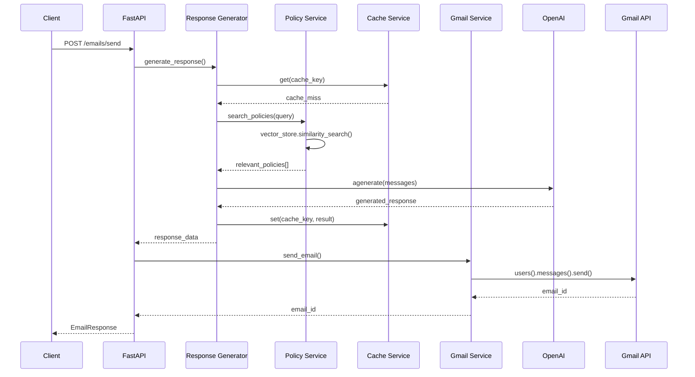

---

## 2. Batch Email Processing (`POST /emails/batch`)

### Background Process Flow

**Client Request** → **FastAPI Router** → **For Each Email** → **Response Generator** → **Policy Service** → **Cache Service** → **Gmail Service** → **Batch Response**

### Detailed Function Call Flow

```
1. Client sends POST request to /emails/batch
   ↓
2. FastAPI validates BatchEmailRequest model
   ↓
3. send_batch_emails() function called in main.py
   ↓
4. Loop through each email in batch:
   ↓
5. For each email: response_generator.generate_response()
   ↓
6. Cache check: cache_service.get(cache_key) [if use_cache=True]
   ↓
7. If cache miss: policy_service.search_policies(query)
   ↓
8. vector_store.similarity_search() in PolicyService
   ↓
9. response_generator._generate_llm_response() called
   ↓
10. OpenAI API call via ChatOpenAI.agenerate()
    ↓
11. Cache response: cache_service.set(cache_key, result)
    ↓
12. gmail_service.send_email() called
    ↓
13. Gmail API call: service.users().messages().send()
    ↓
14. Add to responses array
    ↓
15. Return List[EmailResponse] to client
```

### Mermaid Diagram

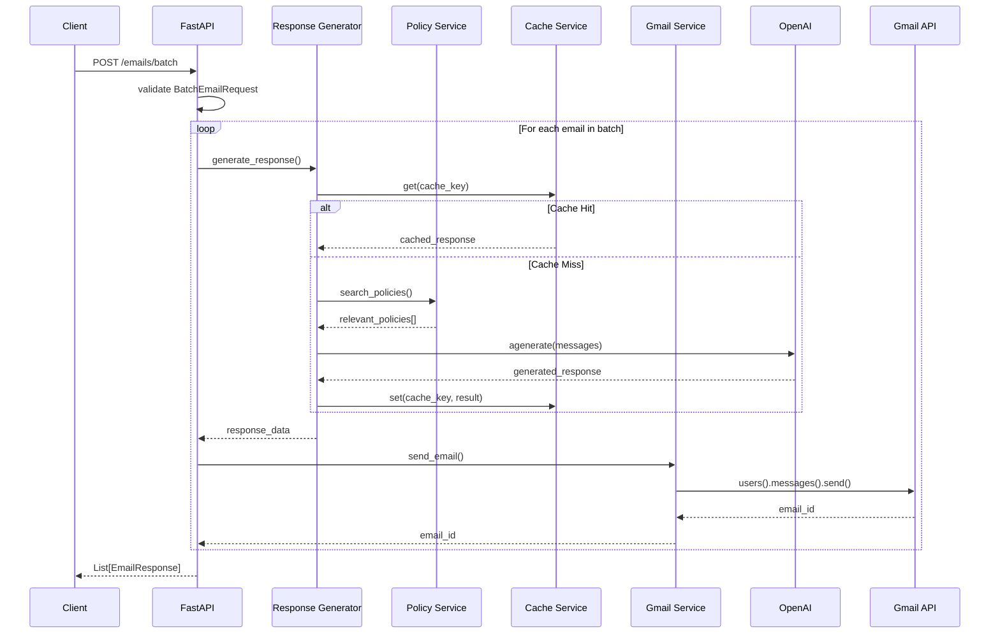

---

## 3. Get Inbox Emails (`GET /emails/inbox`)

### Background Process Flow

**Client Request** → **FastAPI Router** → **Gmail Service** → **Gmail API** → **Response**

### Detailed Function Call Flow

```
1. Client sends GET request to /emails/inbox
   ↓
2. get_inbox_emails() function called in main.py
   ↓
3. gmail_service.get_inbox_emails() called
   ↓
4. Gmail API call: service.users().messages().list()
   ↓
5. For each message: service.users().messages().get()
   ↓
6. Extract headers (subject, sender, etc.)
   ↓
7. Return formatted email list to client
```

### Mermaid Diagram

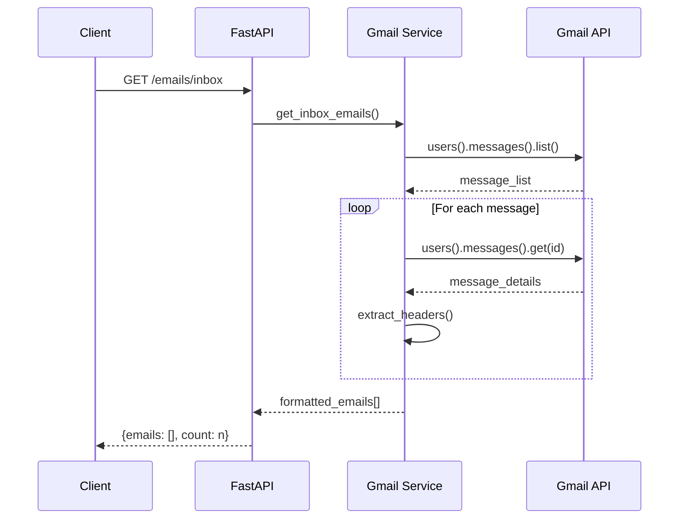

---

## 4. Process Inbox Emails (`POST /emails/process-inbox`)

### Background Process Flow

**Client Request** → **FastAPI Router** → **Background Task** → **Gmail Service** → **Response Generator** → **Auto-Response**

### Detailed Function Call Flow

```
1. Client sends POST request to /emails/process-inbox
   ↓
2. process_inbox_emails() function called in main.py
   ↓
3. BackgroundTasks.add_task(gmail_service.process_inbox_emails)
   ↓
4. Return immediate response to client
   ↓
5. Background task starts:
   ↓
6. gmail_service.process_inbox_emails() called
   ↓
7. gmail_service.get_inbox_emails() called
   ↓
8. For each email: gmail_service._should_auto_respond()
   ↓
9. If auto-respond needed: gmail_service._generate_auto_response()
   ↓
10. response_generator.generate_response() called
    ↓
11. policy_service.search_policies() called
    ↓
12. OpenAI API call for response generation
    ↓
13. gmail_service.send_email() for auto-response
    ↓
14. asyncio.sleep(PROCESSING_DELAY)
    ↓
15. Continue to next email
```

### Mermaid Diagram

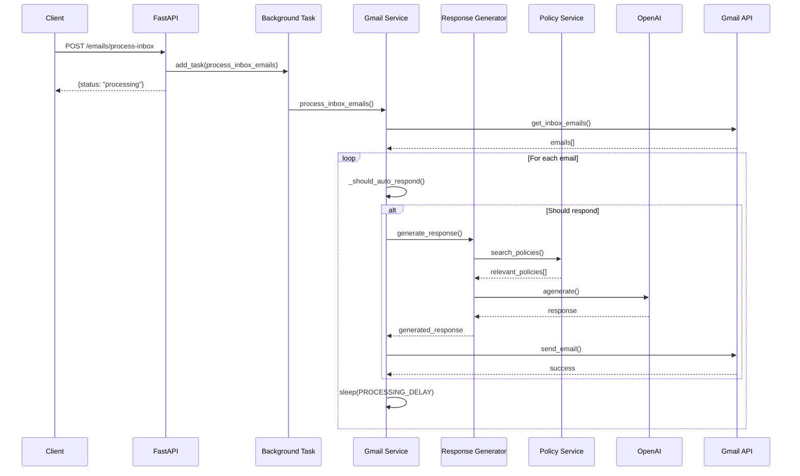

---

## 5. Add Policy (`POST /policies/add`)

### Background Process Flow

**Client Request** → **FastAPI Router** → **Policy Service** → **Vector Store Update** → **Response**

### Detailed Function Call Flow

```
1. Client sends POST request to /policies/add
   ↓
2. FastAPI validates PolicyRequest model
   ↓
3. add_policy() function called in main.py
   ↓
4. policy_service.add_policy() called
   ↓
5. Create new policy object
   ↓
6. Add to policies list
   ↓
7. policy_service._update_vector_store() called
   ↓
8. text_splitter.split_text() for chunking
   ↓
9. Create Document objects with metadata
   ↓
10. FAISS.from_documents() to rebuild vector store
    ↓
11. Return policy_id to client
```

### Mermaid Diagram

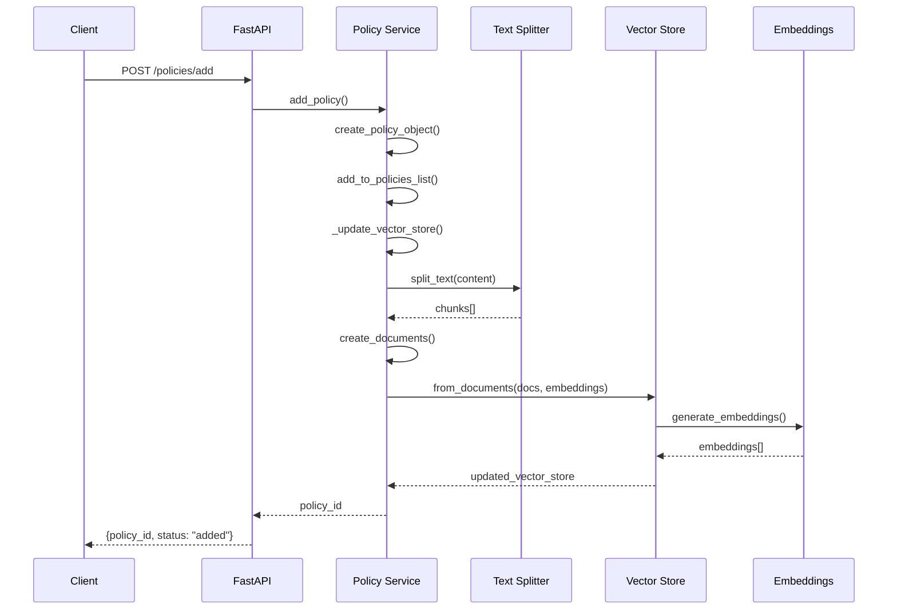

---

## 6. Search Policies (`GET /policies/search`)

### Background Process Flow

**Client Request** → **FastAPI Router** → **Policy Service** → **Vector Search** → **Response**

### Detailed Function Call Flow

```
1. Client sends GET request to /policies/search?query=...
   ↓
2. search_policies() function called in main.py
   ↓
3. policy_service.search_policies() called
   ↓
4. vector_store.similarity_search() called
   ↓
5. OpenAI embeddings generation for query
   ↓
6. FAISS similarity search
   ↓
7. Extract relevant policies from documents
   ↓
8. Return formatted policies to client
```

### Mermaid Diagram

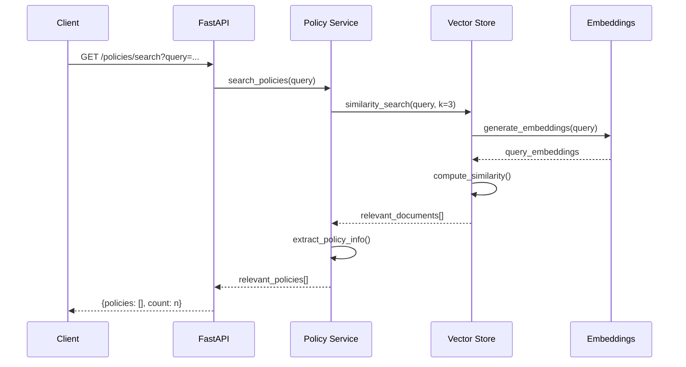

---

## 7. Get All Policies (`GET /policies/all`)

### Background Process Flow

**Client Request** → **FastAPI Router** → **Policy Service** → **Response**

### Detailed Function Call Flow

```
1. Client sends GET request to /policies/all
   ↓
2. get_all_policies() function called in main.py
   ↓
3. policy_service.get_all_policies() called
   ↓
4. Return self.policies list
   ↓
5. Return formatted policies to client
```

### Mermaid Diagram

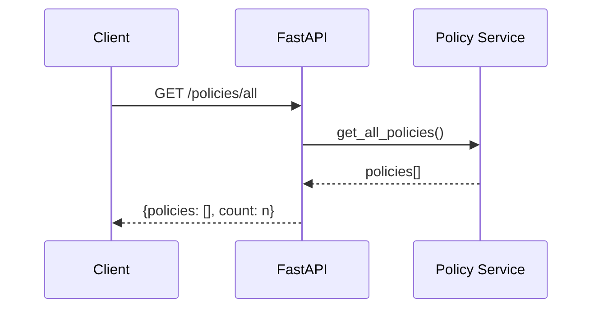

---

## 8. Get Cache Stats (`GET /cache/stats`)

### Background Process Flow

**Client Request** → **FastAPI Router** → **Cache Service** → **Redis** → **Response**

### Detailed Function Call Flow

```
1. Client sends GET request to /cache/stats
   ↓
2. get_cache_stats() function called in main.py
   ↓
3. cache_service.get_stats() called
   ↓
4. redis.info() called
   ↓
5. Extract relevant statistics
   ↓
6. Return formatted stats to client
```

### Mermaid Diagram

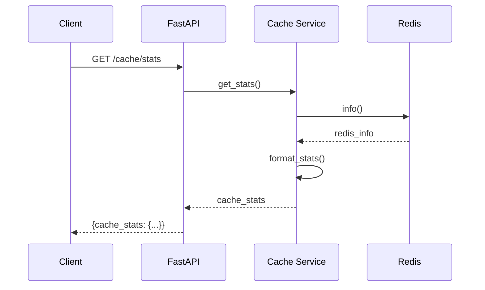

---

## 9. Clear Cache (`POST /cache/clear`)

### Background Process Flow

**Client Request** → **FastAPI Router** → **Cache Service** → **Redis** → **Response**

### Detailed Function Call Flow

```
1. Client sends POST request to /cache/clear
   ↓
2. clear_cache() function called in main.py
   ↓
3. cache_service.clear_cache() called
   ↓
4. redis.flushdb() called
   ↓
5. Return success message to client
```

### Mermaid Diagram

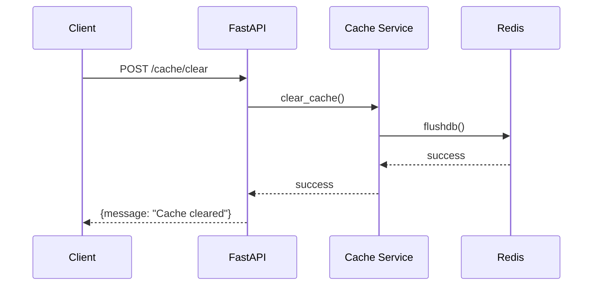

---

## System Startup Flow

### Background Process Flow

**Application Start** → **Service Initialization** → **Ready to Serve**

### Detailed Function Call Flow

```
1. uvicorn starts FastAPI application
   ↓
2. startup_event() called
   ↓
3. gmail_service.initialize() called
   ↓
4. Gmail API credentials loaded
   ↓
5. policy_service.load_policies() called
   ↓
6. Default policies loaded
   ↓
7. Vector store initialized with FAISS
   ↓
8. cache_service.initialize() called
   ↓
9. Redis connection established
   ↓
10. Application ready to serve requests
```

### Mermaid Diagram

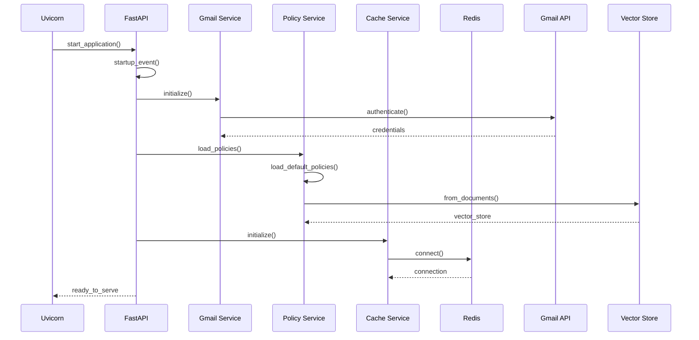

---

## Error Handling Flow

### Background Process Flow

**Error Occurs** → **Exception Handling** → **Logging** → **Error Response**

### Common Error Scenarios

1. **Gmail API Error**
   - Authentication failure
   - Rate limiting
   - Network issues

2. **OpenAI API Error**
   - API key issues
   - Model unavailable
   - Token limits

3. **Redis Connection Error**
   - Service unavailable
   - Connection timeout

4. **Vector Store Error**
   - Embedding generation failure
   - Search index issues

### Mermaid Diagram

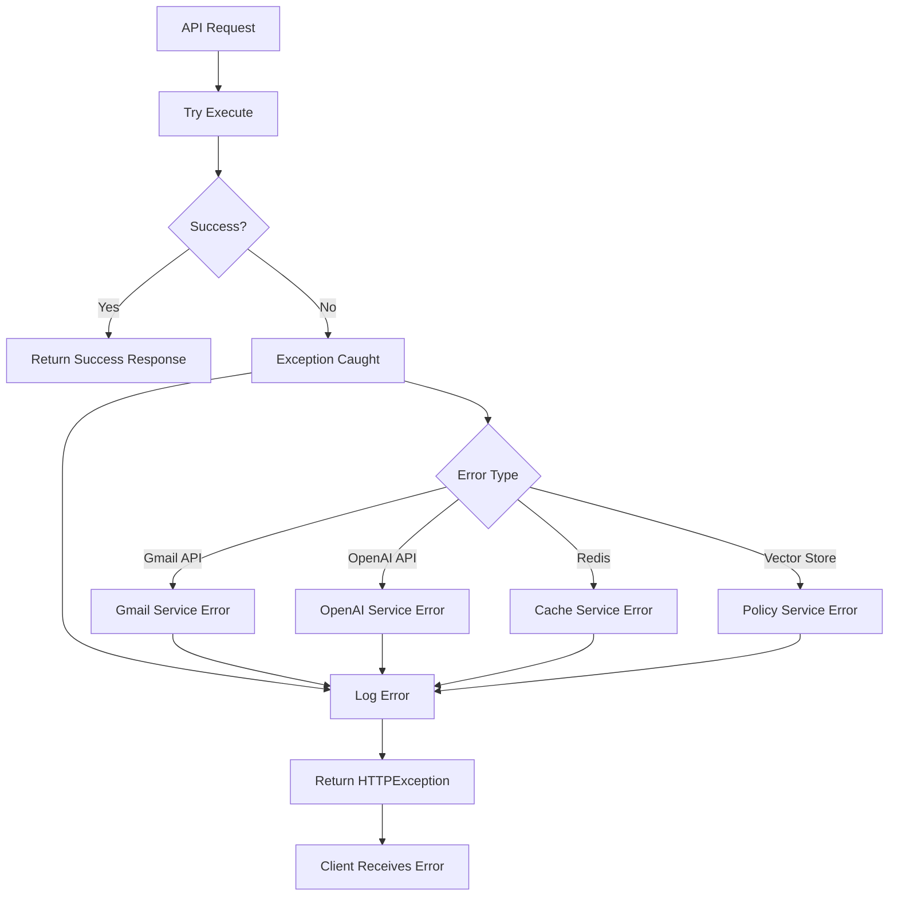

This comprehensive flow documentation shows exactly what happens behind the scenes for each API endpoint, including all function calls, external API interactions, and data flow through the system.